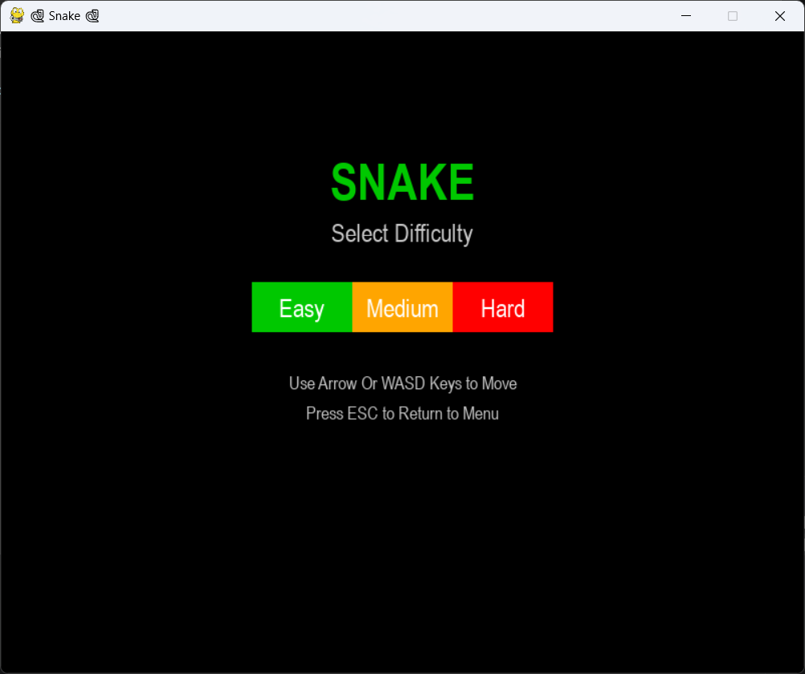
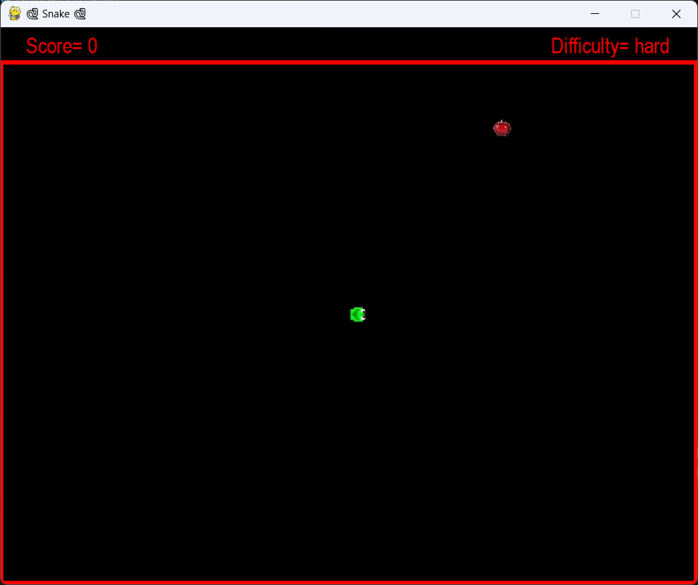
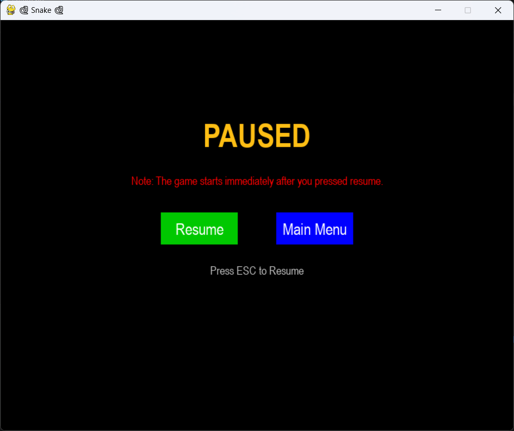
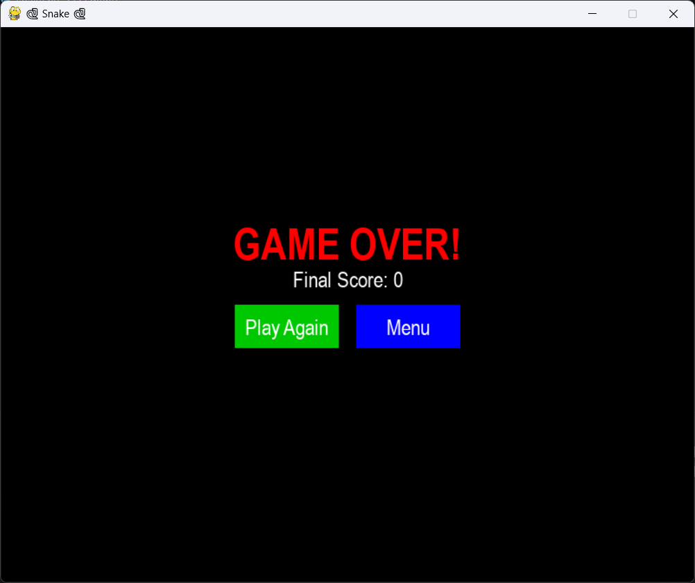

# 🐍 Snake Game (Python & Pygame)

A modern implementation of the classic **Snake** game built with **Python** and **Pygame**.

The game features multiple difficulty levels, a graphical menu, pause functionality, custom sprites, score tracking, and a game over screen with replay support.


## Features

- 🐍 Classic Snake gameplay
- 🎮 Three difficulty levels
  - Easy
  - Medium
  - Hard
- 🍎 Food collection system
- 📈 Live score counter
- 🖼️ Custom snake head sprites
- 🍽️ Custom food sprite
- ⏸️ Pause menu (Resume / Main Menu)
- 🔄 Play Again option
- 🏠 Return to Main Menu
- ⌨️ WASD and Arrow key controls


## Technologies Used

- Python 3
- Pygame
- Object-Oriented Programming (OOP)


## Requirements

- Python 3.10 or newer
- Pygame


## Project Structure

```text
Snake-Game-Pygame/
│
├── snake.py
├── snake_head_U.jpg
├── snake_head_R.jpg
├── snake_head_D.jpg
├── snake_head_L.jpg
├── food.jpg
├── snake.ico
├── screenshots/
│   ├── menu.png
│   ├── gameplay.png
│   ├── pausemenu.png
│   └── gameover.png
├── requirements.txt
├── LICENSE
└── README.md
```


## Installation

Clone the repository:

```bash
git clone https://github.com/Matin-python/Snake-Game-Pygame.git
```

Move into the project directory:

```bash
cd Snake-Game-Pygame
```

Install the required dependencies:

```bash
pip install -r requirements.txt
```

Or install Pygame manually:

```bash
pip install pygame
```


## How to Run

```bash
python snake.py
```


## Controls

| Key | Action |
|------|--------|
| **W** / **↑** | Move Up |
| **A** / **←** | Move Left |
| **S** / **↓** | Move Down |
| **D** / **→** | Move Right |
| **ESC** | Pause / Resume |


## Gameplay

1. Select a difficulty level.
2. Control the snake using the **WASD** keys or the **Arrow Keys**.
3. Eat food to increase your score.
4. Avoid colliding with the walls.
5. Press **ESC** at any time to pause or resume the game.
6. After losing, choose to:
   - 🔄 Play Again
   - 🏠 Return to the Main Menu


## Screenshots

### Main Menu



### Gameplay



### Pause Menu



### Game Over




## Creating an Executable (.exe)

You can package the game into a standalone Windows executable using **PyInstaller**.

### 1. Install PyInstaller

```bash
pip install pyinstaller
```

### 2. Build the Executable

Run the following command from the project directory:

```bash
pyinstaller --onefile --windowed ^
--add-data "food.jpg;." ^
--add-data "snake_head_U.jpg;." ^
--add-data "snake_head_R.jpg;." ^
--add-data "snake_head_D.jpg;." ^
--add-data "snake_head_L.jpg;." ^
snake.py
```

> **Note:** On Linux and macOS, replace the semicolon (`;`) in `--add-data` with a colon (`:`).

### 3. Locate the Executable

After the build completes, the executable will be available in the `dist` folder:

```text
dist/
└── snake.exe
```

You can run `snake.exe` without installing Python.


## Concepts Demonstrated

- Object-Oriented Programming (OOP)
- Game Loop
- Event Handling
- Collision Detection
- Sprite Rendering
- Keyboard Input Handling
- State Management
- Menu System Design


## Future Improvements

- 🐍 Snake body sprites instead of green rectangles
- 💥 Self-collision detection
- 🚫 Prevent reversing direction
- 🪨 Random obstacles
- 🔊 Sound effects and background music
- 💾 High score saving
- 🎞️ Animated snake movement
- 🖥️ Fullscreen mode


## License

This project is licensed under the **MIT License**.


## Author

**Mohammad Reza Bakhshandeh**

Electrical Engineering (Electronics) Graduate

Interested in **Python Development, Computer Vision, Machine Learning, Deep Learning, and Artificial Intelligence.**
